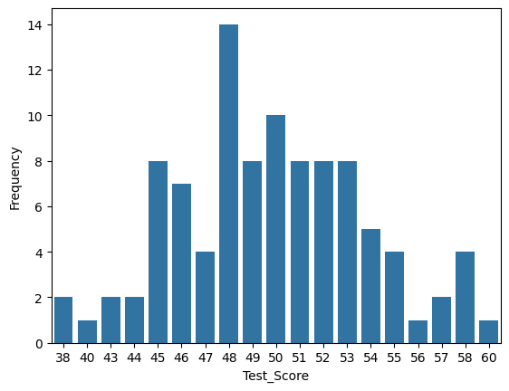

# SQL Magic in Jupyter with SQLite

This project demonstrates how to use **SQL magic commands inside a Jupyter Notebook** to interact with a SQLite database directly from notebook cells. Instead of writing full Python database boilerplate for every query, the notebook uses magic commands to connect to the database, run SQL statements, inspect results, and then visualize part of the output with Python.

---

## Project Overview

The notebook explores a simple but useful workflow for interactive database analysis:

- load SQL support inside Jupyter
- connect to a SQLite database file
- execute SQL queries directly in notebook cells
- inspect returned tables
- move query results into Python for plotting and analysis

This approach is helpful for learning SQL, testing queries quickly, and combining database operations with notebook-based data analysis.

---

## Why SQL Magic?

Normally, working with a database in Python requires steps such as:

- importing a database library
- opening a connection
- creating a cursor
- executing SQL
- fetching rows
- formatting output manually

With SQL magic, much of that process becomes more direct inside the notebook. You can write SQL in a cell and immediately see the results, which makes experimentation much easier.

Typical setup looks like this:

```python
%load_ext sql
%sql sqlite:///SQLiteMagic.db
````

After that, entire cells can be written as SQL queries.

---

## Database Used

The notebook uses a SQLite database file named:

```text
SQLiteMagic.db
```

SQLite is a lightweight relational database system that stores everything in a single local file. That makes it convenient for small projects, teaching, and hands-on practice in notebooks.

---

## Querying Data Inside the Notebook

Once the connection is established, SQL statements can be executed directly in notebook cells.

Example pattern:

```sql
%%sql
SELECT *
FROM table_name;
```

This makes it easy to inspect data, filter rows, compute aggregates, and summarize columns without switching back and forth between Python connection code and SQL syntax.

The notebook’s workflow is centered around writing queries, viewing the returned tables, and using those results for further analysis.

---

## Combining SQL with Python

One of the main advantages of notebook-based SQL work is that query results can be used immediately in Python. This allows the project to move from:

1. database query
2. tabular result
3. Python processing
4. visualization

That combination makes the notebook useful not just for database access, but also for lightweight exploratory data analysis.

---

## Visualization

After querying and organizing the data, the notebook visualizes part of the result with a bar plot.



This figure helps summarize the distribution of values more clearly than raw table output alone.

### Interpretation

* Some value ranges appear much more frequently than others
* The distribution is uneven rather than flat
* The data appears to cluster around certain ranges instead of being spread uniformly

### Conclusion from the plot

The bar plot suggests that the queried variable has a non-uniform distribution, with certain intervals occurring more often than the rest. This kind of visualization is useful because it reveals patterns that may not be obvious from SQL output tables alone.

---

## Main Ideas Demonstrated

This notebook highlights several practical ideas:

* running SQL directly inside Jupyter
* using SQLite as a local relational database
* simplifying query execution with magic commands
* combining SQL results with Python-based plotting
* making database exploration more interactive

---

## File Structure

```text
SQL-magic.ipynb     # main notebook
SQLiteMagic.db      # SQLite database used by the notebook
barPlot.png         # plot generated from queried data
README.md           # project documentation
```

---

## Notes

* The SQL extension must be loaded before SQL magic commands can be used
* The database path must match the actual file location
* Plotting requires Python visualization libraries such as matplotlib
* SQL magic is especially useful for quick experiments and educational projects

---

## Future Improvements

Possible next steps for this project include:

* adding more advanced SQL queries such as joins and nested queries
* comparing multiple query outputs visually
* building reusable notebook sections for database exploration
* extending the analysis with pandas after query execution

---

